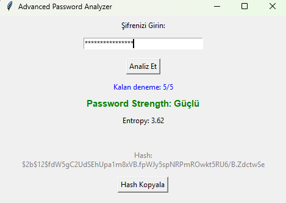
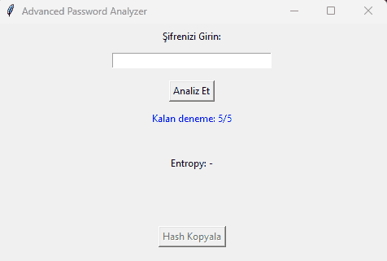

## 🔐 Password Analyzer with GUI





This project is a Python-based password security analyzer designed to evaluate the strength of user-defined passwords using both statistical and rule-based security techniques.  
The application provides real-time feedback through a graphical user interface (GUI), making password security concepts easy to understand and visualize.

The goal of this project is not only to classify passwords as weak or strong, but also to demonstrate **why** a password is insecure by combining entropy analysis, common password detection, and defensive security mechanisms.

---

## 🚀 Features

- **Rule-based validation**
  - Minimum password length enforcement
  - Uppercase, lowercase, digit, and special character checks

- **Statistical strength analysis**
  - Shannon entropy calculation to measure password randomness

- **Weak password detection**
  - Dictionary-based checks against commonly used passwords
  - Blacklist and simple pattern detection (e.g., sequential numbers, predictable structures)

- **Defensive security mechanisms**
  - Rate limiting with temporary lockout after multiple failed attempts
  - Countdown-based lock feedback for better user experience

- **Secure password handling**
  - Passwords are never stored in plaintext
  - Strong passwords are hashed using **bcrypt**

- **User interface**
  - Tkinter-based GUI
  - Color-coded feedback for password strength (weak, medium, strong)


---

## 🔐 Password Analyzer with GUI 

Bu proje, kullanıcı tarafından girilen şifrelerin güvenlik seviyesini hem **kural tabanlı** hem de **istatistiksel** yöntemler kullanarak analiz eden, Python ile geliştirilmiş bir şifre analiz uygulamasıdır.  
Grafik kullanıcı arayüzü (GUI) sayesinde kullanıcıya anlık ve anlaşılır geri bildirim sunar.

Projenin amacı yalnızca bir şifreyi “zayıf” veya “güçlü” olarak sınıflandırmak değil; aynı zamanda **bir şifrenin neden güvensiz olduğunu** entropy analizi, yaygın şifre kontrolleri ve savunmacı güvenlik mekanizmaları ile açıklamaktır.

---

## 🚀 Özellikler

- **Kural tabanlı doğrulama**
  - Minimum şifre uzunluğu kontrolü
  - Büyük harf, küçük harf, rakam ve özel karakter kontrolleri

- **İstatistiksel güç analizi**
  - Şifre rastgeleliğini ölçmek için Shannon Entropy hesaplaması

- **Zayıf şifre tespiti**
  - Yaygın kullanılan şifreler için dictionary kontrolü
  - Blacklist ve basit pattern tespiti (ör. ardışık rakamlar, tahmin edilebilir yapılar)

- **Savunmacı güvenlik mekanizmaları**
  - Çoklu başarısız denemelerde rate limiting
  - Geçici kilitleme ve geri sayım ile kullanıcı bilgilendirmesi

- **Güvenli şifre işleme**
  - Şifreler düz metin olarak saklanmaz
  - Güçlü şifreler **bcrypt** algoritması ile hashlenir

- **Kullanıcı arayüzü**
  - Tkinter tabanlı grafik arayüz
  - Şifre gücüne göre renkli geri bildirim (zayıf, orta, güçlü)


Example of password analysis and feedback via the GUI

GUI üzerinden şifre analizi ve geri bildirim örneği





## How to Run
```bash
pip install bcrypt
python gui.py


